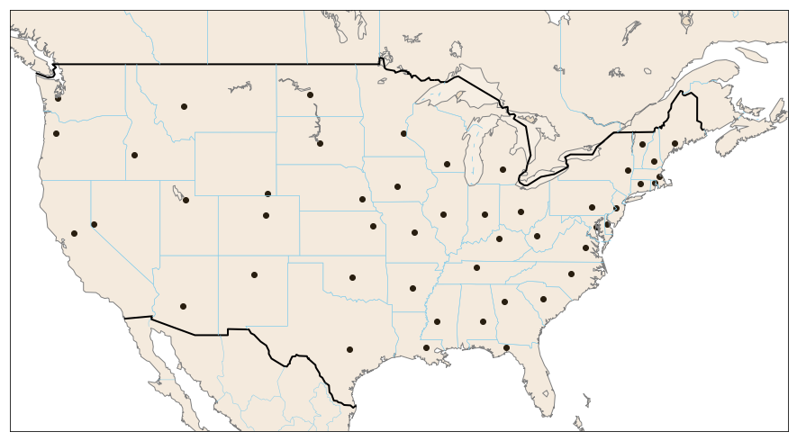
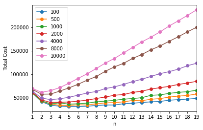
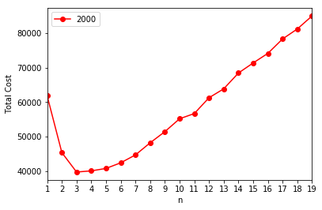
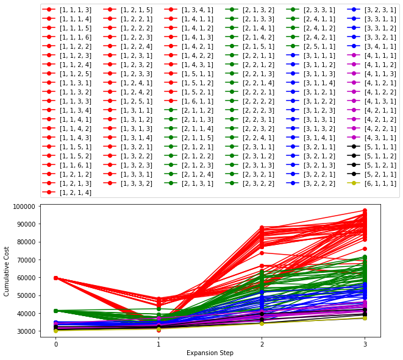
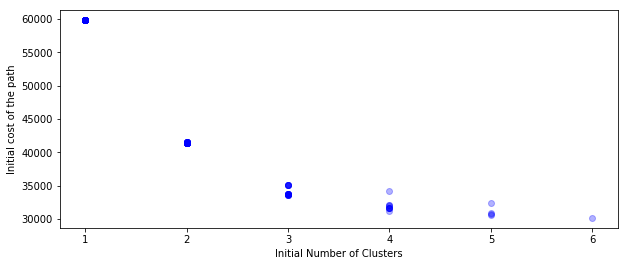
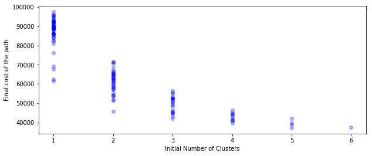
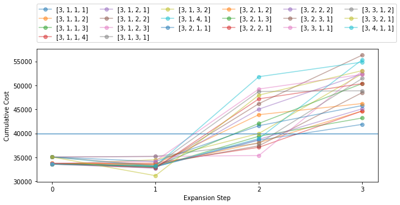
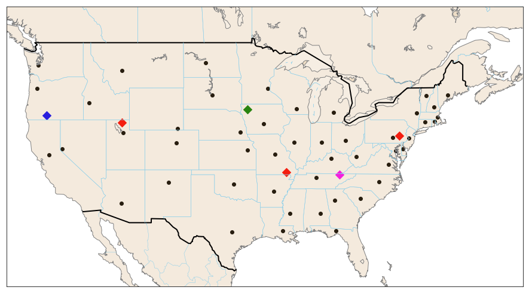

# Problem Statement

> PiedPiper has decided to diversify their business and is planning to open a retail store in the capital city of each of the states in the USA. They have also decided to use Data Centers to support the operations at each of these new retail stores however they are yet to decide on the number and location of data centers they should use and how they should allocate a retail store to data center. Can you design a solution for retail store to data center allocation to help PiedPiper expand optimally?


# Solution

This blog intend to give an outline of my approach avoiding intermittent code snippets (typical of notebooks). Detailed solution with code snippets can be found here.

## Assumptions


 1. For simplicity we consider only Mainland-US excluding `Washington DC`(not a state), `Hawaii`(HI) and `Alasaka`(AK).
 2. The cost of connecting [or disconnecting] a data-center $(C)$ to a retail-store$(R)$ is directly proportional to the distance between them. (This is a parametrized function which can be altered and need not be based on distance). Here I chose the constant to be 1, hence, 
   $$Cost_{ij} = Distance(C_{i},R_{j})$$
   - Since non-eucledian geometry, distance is calculated as "_Great-circle distance between two points on a sphere given their longitudes and latitudes_" using haversine formula.
 3. Setting up a data center will have an initial cost: $I$
 4. We will expand our data centers in multiple stages. 
 5. We will start with one or more data center initially and only expand the number of data centers at a rate of upto 4 per expansion step. This is to reduce computational complexity and you may choose it in anyway seems fit.
 6. During every expansion to next stage, we will not discard the data center from previous step. Instead, if a retail center is closer to a new data center, we will disconnect from current one and connect to new data center in the expansion phase. 
 7. Cost of disconnecting a retail center from a data center is regarded as sunk cost from expansion to next stage.
 8. One data center can support all retail stores. This is to start the search with one data center. In realtime situation we can change it accordingly and start with the minimum data centers needed to support entire retail centers.
 9. We assume there is 5 stages of expansion, again to reduce the computational space. One mayincrease it based on need with more compute power.

>How the costs are defined is critical in finding the optimal minima. Ideally, this has to be based on business knowledge.


## Map of retail centers across US on each state capital.


## Data center allocation

Since cost for a connection is equivalent to distance between data-center and retail-center, it is ideal to use a clustering algorithm (here I used K-Means) to find a cluster center which minimizes distance. Again, during expansion to a new stage, old cluster centers are not discarded hence they need to be static. The modified cluster class is included in the detialed version along with fuction used to calculate optimizing metric which is the sum of overall distance to all data-centers and intial setup cost $(I\times n)$.

## Optimal Cluster Number $(n)$

Let's assume there is a no expansion and we can setup $n$ number of data-centers. We can give the total cost as,
$$ Total\space Cost  = (I\times n)+ Cost_{ij}$$

The optimal number of clusters  $(n)$ after all stages of expansion can be revealed by plotting $Total\space Cost$ vs. $n$ for various $I$ as shown below




> We fix the cost of setting-up one data center at $I=2000$ units to find out the optimal expansion path.



>For $I=2000$ optimum number of data centers seems to be around 5 to 10, after which total cost escalates.

## Path Search

Since expansion happens along multiple phases (upto 4 at a time), we need to create multiple paths to reach final number of clusters. Here I choose final number of clusters `k_num` between 5 and 10 based on optimality and represent it as a list of lists as shown below. Also, I reduced number of stages of expansion to 5.

```python
expansion_path = 
                [[1, 1, 1, 3],
                 [1, 1, 1, 4],
                  ...
                 [2, 3, 1, 1],
                 [2, 3, 1, 2],
                 ...
                 [3, 2, 2, 2],
                 [3, 2, 3, 1],
                 ...
                 [5, 2, 1, 1],
                 [6, 1, 1, 1]]
```



For a given say, `exapansion_path[0]` there is a total cost accumulated during each expansion. For example when a new data-center is allocated to the retail-center during expanded phase, there exists a sunck cost for disconnecting retail-center from old data-center in the previous phase. Shown above is the cumulative cost incurred with each expansion.


## Observations

 - More the number of data-centers that you start with initially, lesser the final cost as well as cost per expansion(trivial).
 - Ideal path should have low cumulative cost and low volatility especially if funding for expansion is done in multiple stages.

### Lets examine initial and final cost distribution based on initial number of clusters:

>Since cost increase s after 3, starting with 3 data-centers might be a good idea. But again, it also depends on how much you can spare during first phase.



>As show below, the difference in median final cost also plataeus after staring with 3 clusters.




>Combining both arguments above, lets look at all paths starting with 3 data-centers. the lowest final cost belongs to the exapansion path: `[3, 1, 1, 1]`



## Best Canditates

 - From a bussiness perspective of a young start-up, the best candidate depends on affordability especially the first stage.
 - If we can invest in 3 centers (max) in the begining phase, start with lowest final cost which starts with 3. Similarly, if you choose to start with 2, pick the path with lowest cumulative cost at the end of expansion.
 - For curiosity sake, I have listed below top 10 candidates sorted by final cost.

```
[([5, 1, 1, 1], 37130.608651604925),
 ([6, 1, 1, 1], 37418.47830919361),
 ([5, 1, 1, 2], 39005.3031291716),
 ([5, 2, 1, 1], 39556.901699574504),
 ([4, 1, 1, 1], 39657.461730428855),
 ([4, 2, 2, 1], 40808.523863741444),
 ([4, 1, 1, 3], 41097.02832830972),
 ([4, 1, 2, 2], 41498.06502823472),
 ([3, 1, 1, 1], 41877.16421835121),
 ([5, 1, 2, 1], 42117.09540175221)]
```

## Data-center expansion map for the candidate `[3, 1, 1, 1]`



>Shown above is the expansion path for `[3, 1, 1, 1] => ['red', 'green', 'blue', 'magenta']`. Diamond markers correspond to the locations for data-centers.
